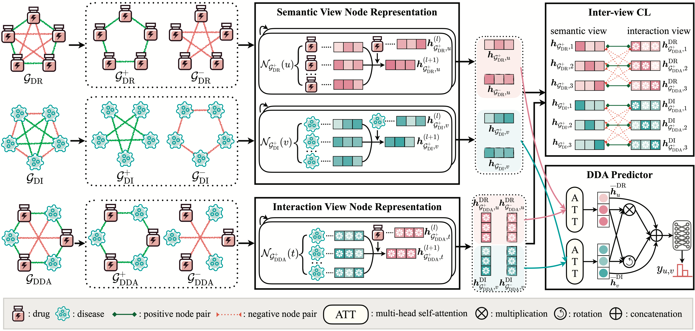

# paper_SIGDR

This is the PyTorch implementation for paper "Sign-aware Graph Contrastive Learning for Drug Repositioning".

## Introduction

Recently, growing efforts are devoted to applying graph neural networks (GNNs) for effectively modeling drug-disease associations (DDAs). However, current GNN-based methods are generally designed for unsigned graphs and fail to gain complementary insights provided by negative links. Despite the proposal of sign-aware GNNs in general fields, there exist two intractable challenges when indiscriminately deploying prior solutions into drug repositioning. (i) How to explicitly connect the nodes within the same set (disease-disease and drug-drug)? (ii) How to design the contrastive learning objective for signed graphs? To this end, we propose a novel sign-aware graph contrastive learning approach, namely SIGDR, which takes both the positive and negative links from signed biological networks into consideration to identify underlying DDAs. To handle the first challenge, we measure the drug and disease similarity and form signed unipartite graphs according to similarity scores. For the second challenge, a signed bipartite graph is then constructed from the annotated dataset. 

In this paper, we highlight the critical role of integrating complementary negative links into graph-based learning framework. To the best of our knowledge, it is the first time that link signs in biological networks are sufficiently characterized for drug repositioning.

## Environment:
The codes of SIGDR are implemented and tested under the following development environment:
-  Python 3.8.19
-  cudatoolkit 11.5
-  pytorch 1.10.0
-  dgl 0.9.1
-  networkx 3.1
-  numpy 1.24.3
-  scikit-learn 1.3.0

## Datasets
We verify the effectiveness of our proposed method on three commonly-used benchmarks, i.e., <i>B-dataset, C-dataset, </i>and <i>F-dataset</i>.
| Dataset |  Drug |  Disease |  Drug-Disease| Sparsity |
|:-------:|:-------:| :-------:| :-------:| :-------:|
|B-dataset   | $269$ | $598$| $18416$ | $11.45\%$|
|C-dataset   | $663$ | $409$| $2532$  | $0.93\%$|
|F-dataset   | $592$ | $313$| $1933$  | $1.04\%$|

These datasets can be downloaded from [google drive](https://drive.google.com/drive/folders/1w9orlSgM_HlwGwaVWPLYgRqbjdQc7RCv). Herein, we elaborate on the corresponding data files.
- <i>DrugFingerprint.csv</i>: The drug fingerprint similarities between each drug pairs.
- <i>DrugGIP.csv</i>: The drug Gaussian interaction profile (GIP) kernel similarities between each drug pairs.
- <i>DiseasePS.csv</i>: The disease phenotype similarities between each disease pairs.
- <i>DiseaseGIP.csv</i>: The disease GIP kernel similarities between each disease pairs.
- <i> DrugDiseaseAssociationNumber.csv </i>: The known drug-disease associations.
- <i> Drug_mol2vec.csv </i>: The 300-dimensional mol2vec embeddings of drugs, obtained from paper [Mol2vec: unsupervised machine learning approach with chemical intuition. Journal of chemical information and modeling, 2018, 58(1): 27-35](https://pubmed.ncbi.nlm.nih.gov/29268609/).
- <i> DiseaseFeature.csv </i>: The 64-dimensional MeSH embeddings of diseases, obtained from paper [MeSHHeading2vec: a new method for representing MeSH headings as vectors based on graph embedding algorithm. Briefings in bioinformatics, 2021, 22(2): 2085-2095](https://academic.oup.com/bib/article/22/2/2085/5813844).

Above datasets utilized in this paper are consistent with the previous work [AMDGT: Attention aware multi-modal fusion using a dual graph transformer for drug–disease associations prediction. Knowledge-Based Systems, 2024, 284: 111329](https://github.com/JK-Liu7/AMDGT).

## Code Files:
The introduction of each <code> py </code> file is as follows:
- <i>contrastive_learning.py</i>: The implementation of inter-view contrastive learning.
- <i>data_preprocessing.py</i>: The implementation of data preprocessing.
- <i>graph_transformer_layer.py</i>: The implementation of graph transformer layer.
- <i>graph_transformer.py</i>: The implementation of basic graph transformer.
- <i>metric.py</i>: The implementation of evaluation metrics.
- <i>model.py</i>: The implementation of entire SIGDR model.
- <i>main.py</i>: The implementation of model training.
- <i>parse_args.py</i>: The parameter settings.

## How to Run the Code:
Please firstly download the datasets and unzip the downloaded files. Next, create the <code>Datasets/</code> folder and move the unzipped datasets into this folder. The command to train GCGB on the B-dataset, C-dataset or F-dataset is as follows.

<ul>
<li>B-dataset<pre><code>python main.py --dataset = B-dataset</code></pre>
</li>
<li>C-dataset<pre><code>python main.py --dataset = C-dataset</code></pre>
</li>
<li>F-dataset<pre><code>python main.py --dataset = F-dataset</code></pre>
</li>
</ul>
</body></html>
